<div align="center">

<h1>Hi 👋, I'm Mohamed Elbestawy</h1>
<h3>Java Full Stack Engineer</h3>


</div>

---

## 🧑‍💻 About Me

```text
🏗️  Java Full Stack Engineer — Backend-first, Frontend-capable
⚙️  Spring Boot · Angular · Apache Camel · REST APIs
🏥  Enterprise Healthcare Systems (FHIR/HL7) & Islamic Finance
🔐  Auth & Security: JWT · OAuth2 · Keycloak · Okta
🐳  Containerized deployments with Docker
🧹  Clean Code advocate · Production-grade mindset
📍  Cairo, Egypt
```

---

## 🛠️ Tech Stack

<table>
  <tr>
    <td valign="top" width="50%">

**☕ Backend**

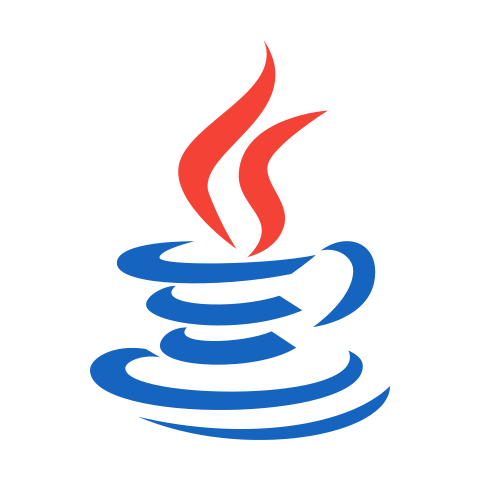
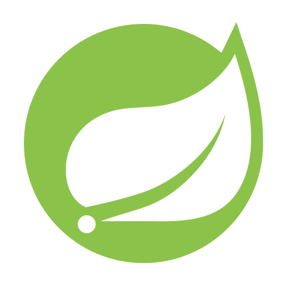

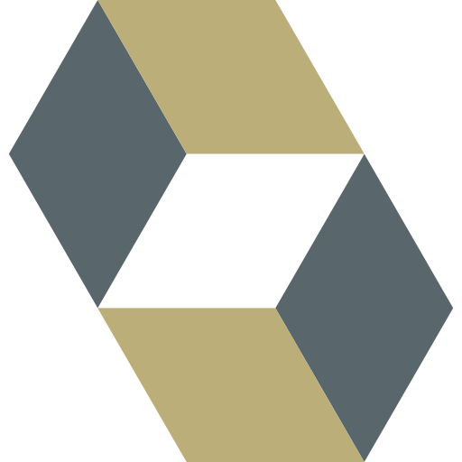
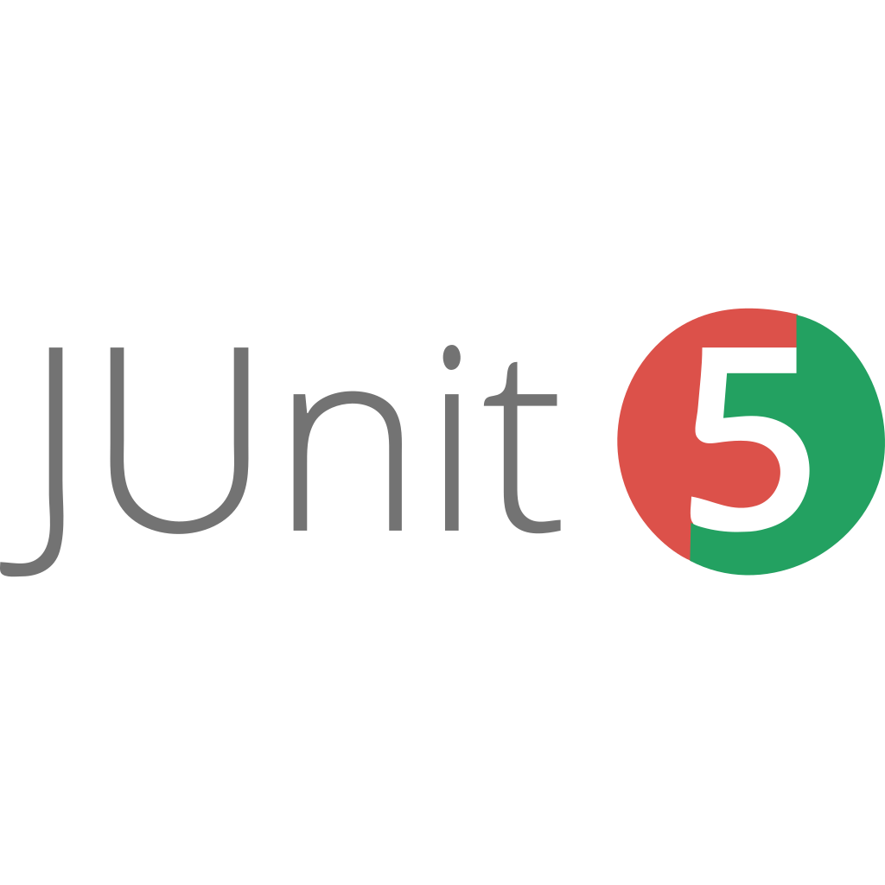


**🔐 Auth & Security**


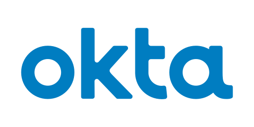

    </td>
    <td valign="top" width="50%">

**🌐 Frontend**


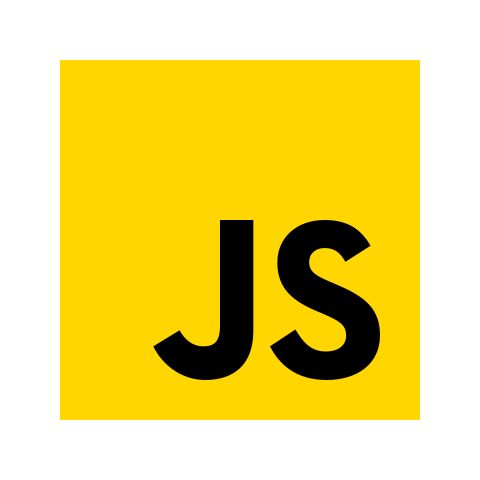


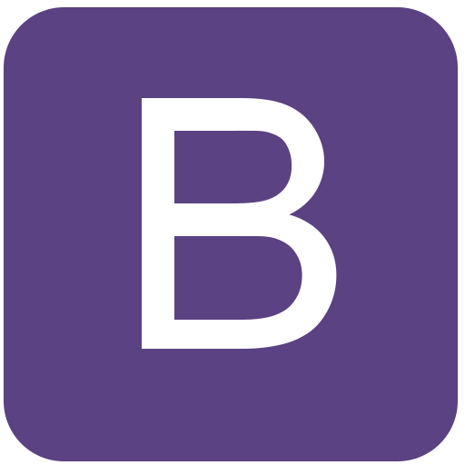
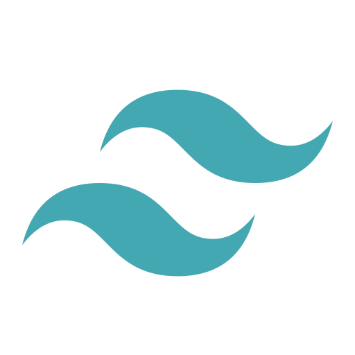

    </td>
  </tr>
  <tr>
    <td valign="top" width="50%">

**🗄️ Databases & Migrations**


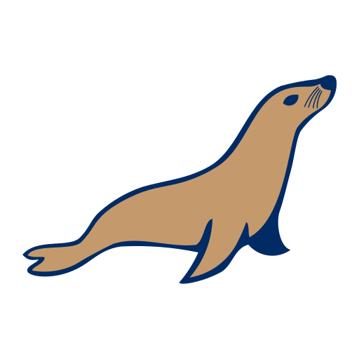


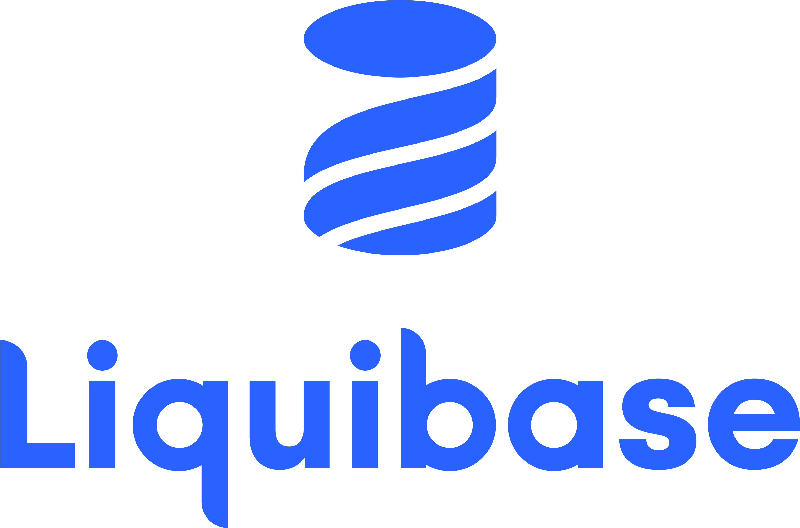

    </td>
    <td valign="top" width="50%">

**🐳 DevOps & Tools**

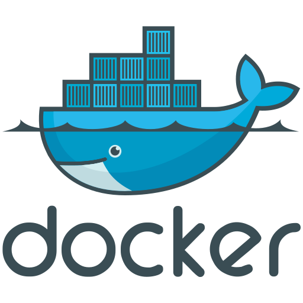

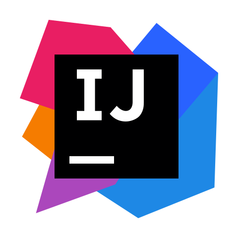

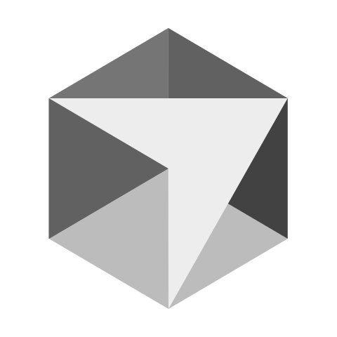
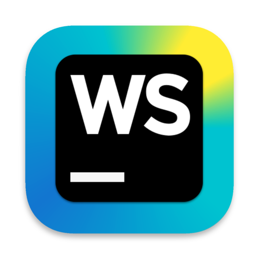


    </td>
  </tr>
</table>

---

## 🌐 Connect With Me

<div align="center">

<a href="https://linkedin.com/in/elbestawy" target="_blank">
  
</a>
&nbsp;&nbsp;
<a href="mailto:melbestawyyy@gmail.com" target="_blank">
  
</a>
&nbsp;&nbsp;
<a href="https://www.codewars.com/users/elbestawyy" target="_blank">
  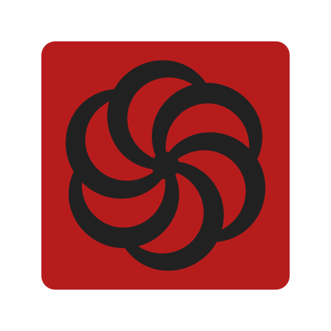
</a>

</div>

---

<div align="center">
  
</div>
